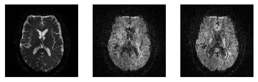
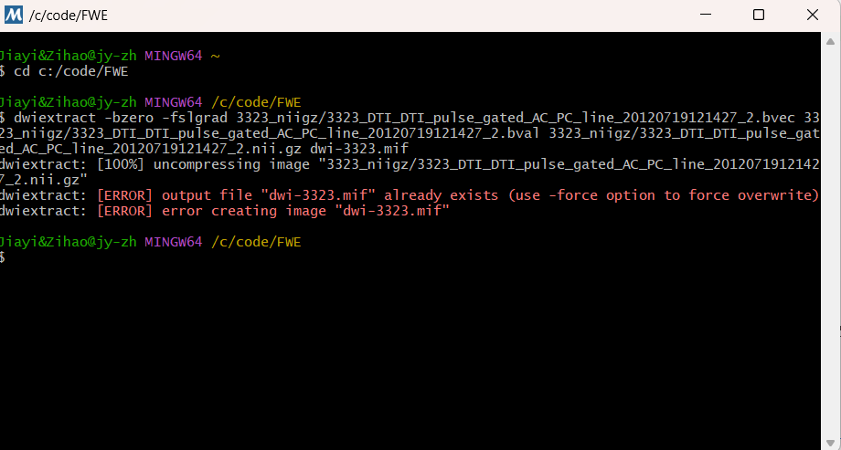
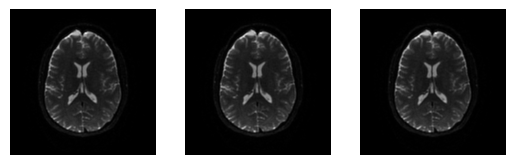
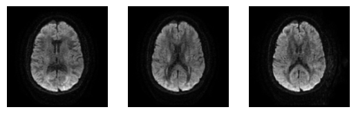
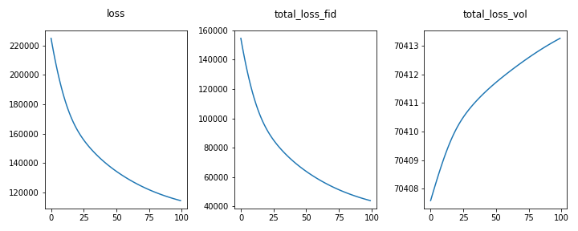
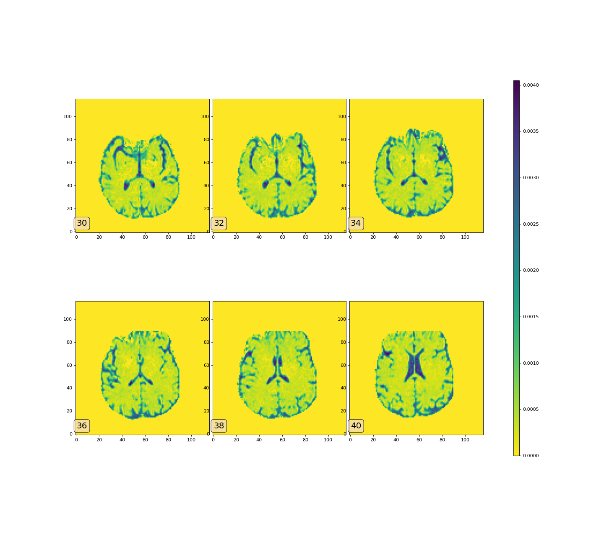
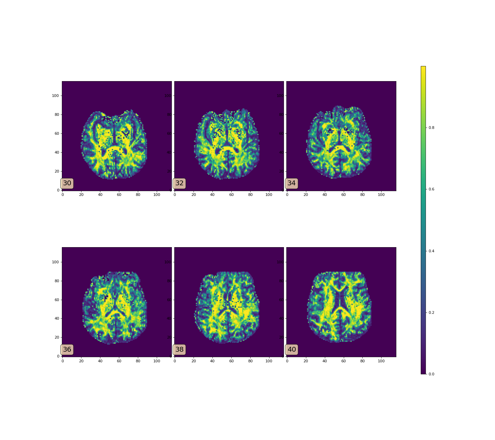

# Free Water estimation

## Preprocess

`python: 3.11`

(1) convert neuroimaging data from the DICOM format to the NIfTI format

install [dcm2niix](https://github.com/rordenlab/dcm2niix)
```shell
python -m pip install dcm2niix
```

convert neuroimaging data
```shell
dcm2niix -z y -o <target_dir> <data_dir>
```
for example
```shell
dcm2niix -z y -o 3323_niigz 3323_DTI
```
where `3323_DTI` is extracted from `3323_DTI.zip`

(2) Between-volumes Motion Correction on DWI datasets

install [dipy](https://dipy.org/)
```shell
pip install dipy==1.7.0
```
DTI original image data：



After motion correction：


code: refer to [motion_correction.ipynb](motion_correction.ipynb)

(3) Eddy current correction

ECMOCO Tool: http://www.diffusiontools.com/documentation/ECMOCO.html

FSL Tool: https://fsl.fmrib.ox.ac.uk/fsl/fslwiki/eddy

eddymotion Package: https://github.com/nipreps/eddymotion


eddymotion框架依赖ants和dipy库

**安装ants**: 只支持mac或者linux

参考[安装教程](https://github.com/ANTsX/ANTs/wiki/Compiling-ANTs-on-Linux-and-Mac-OS)

```shell
workingDir=${PWD}
git clone https://github.com/ANTsX/ANTs.git
mkdir build install
cd build
cmake \
    -DCMAKE_INSTALL_PREFIX=${workingDir}/install \
    ../ANTs 2>&1 | tee cmake.log
make -j 4 2>&1 | tee build.log
cd ANTS-build
make install 2>&1 | tee install.log
```

`install`目录下会有bin和lib，要设置环境变量！

```shell
export ANTSPATH=/install/bin/
export PATH=${ANTSPATH}:$PATH
```

安装成功验证

```shell
which antsRegistration
```

返回设置的路径，例如：install/bin/antsRegistration

为了进行eddy motion estimation，除了bvec、bval、dwi的数据，还需要brain mask、mean b0、gradient的数据。其中mean b0需要使用mrtrix工具进行计算，而gradient则需要从FSL格式转到RAS+B格式。

**mrtrix安装**:

[参考链接](https://mrtrix.readthedocs.io/en/0.3.16/installation/windows_install.html)

注意要在下载的MSYS2 MinGW中进行操作😊😊😊



**生成mean BO文件**，命令格式如下

```text
dwiextract -bzero -fslgrad .bvec .bval .nii.gz(dwi file) output | mrmath -axis 3 input mean output
```

示例：

```shell
dwiextract -bzero -fslgrad 3323_niigz/3323_DTI_DTI_pulse_gated_AC_PC_line_20120719121427_2.bvec 3323_niigz/3323_DTI_DTI_pulse_gated_AC_PC_line_20120719121427_2.bval 3323_niigz/3323_DTI_DTI_pulse_gated_AC_PC_line_20120719121427_2.nii.gz dwi-3323.mif
```

生成的mean b0文件可视化结果，使用`mrview`命令查看即可：


**gradient数据文件生成和转换的方法：**

```python
def fslgrad2rasb(dwi_file, fbval, fbvec, out_rasbn_file):
    """Save gradient table in RAS+B format taking as input the DWI with FSL `.bval` and `.bvec`."""
    import numpy as np
    from nibabel import load
    from dipy.io import read_bvals_bvecs
    
    # Read / Load
    img = load(str(dwi_file))
    bvals, bvecs = read_bvals_bvecs(str(fbval), str(fbvec))
    
    # Apply the affine transform to bvecs
    bvecs_tr = np.matmul(img.affine[:3,:3], bvecs.T).T
    
    # Normalize the bvecs
    norm = np.sum(bvecs_tr**2, axis=1)
    bvecs_tr_norm = np.zeros_like(bvecs_tr)
    for i in range(bvecs_tr.shape[0]):
        bvecs_tr_norm[i, :] = bvecs_tr[i, :] / norm[i] 
    # Handles bzeros
    bvecs_tr_norm = np.nan_to_num(bvecs_tr_norm)
    
    rasbn = np.c_[bvecs_tr_norm, bvals]
    print(rasbn)
    
    # Save Nx4 numpy matrix in TSV text file
    np.savetxt(fname=str(out_rasbn_file),
               delimiter="\t",
               X=rasbn)
    
```

将这些数据加载为eddymotion库中的DWI类型，再进行预测~(●'◡'●)，得到的结果时仿射变换矩阵。

官方说明：

```text
A list of :math:`4 \times 4` affine matrices encoding the estimated
        parameters of the deformations caused by head-motion and eddy-currents.
```

```python
from eddymotion import dmri
data = dmri.load(
    str(dwi_file),
    gradients_file=str(rasb_file),
    b0_file=str(mean_B0_file),
    brainmask_file=str(brain_mask_file)
    )

from eddymotion.estimator import EddyMotionEstimator
EddyMotionEstimator.fit(data, model="b0")
```

model可以选择``"3DShore"``, ``"SFM"``, ``"DTI"``, ``"DKI"``, ``"S0"``


**修改源码**:

由于ants中的use-estimate-learning-rate-once参数已经被舍弃，需要修改nipype中的代码

将`fwe/lib/python3.11/site-packages/nipype/interfaces/ants/`下的`registration.py`中的这段代码注释：

```python
if isdefined(self.inputs.use_estimate_learning_rate_once):
    retval.append(
        "--use-estimate-learning-rate-once %d"
        % self.inputs.use_estimate_learning_rate_once[ii]
    )
```

原图：



eddy motion correction后的可视化结果：




code: refer to [Parallel_Run_DTI_Model.ipynb](Parallel_Run_DTI_Model.ipynb)

## Compute Free-Water Maps: 

(1) Estimate free-water maps: Utilize appropriate algorithms (e.g., Free-Water Elimination, FWE) to estimate the presence of free water in each voxel. Free water refers to the cerebrospinal fluid (CSF) component in the brain, which has isotropic diffusion characteristics.

(2) Generate free-water maps: Generate maps that represent the volume fraction of free water in each voxel, indicating the contribution of free water in the diffusion signal at that location.

model convergence:



Free-Water Maps:


## Free-Water Correction:

(1) Correct DTI metrics for free water: Using the estimated free-water maps, apply corrections to the DTI metrics (FA, MD, etc.) to eliminate the effects of free water contamination.

(2) Obtain free-water corrected DTI metrics: The corrected DTI metrics represent diffusion properties in the brain tissue, excluding the effects of free water.

Mean Diffusivity (free water corrected):



Fractional Anisotropy (free water corrected):



code: refer to [example_customized.ipynb](example_customized.ipynb)

